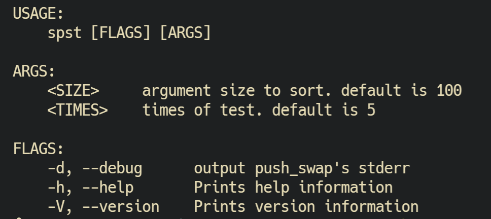

[](https://opensource.org/licenses/MIT)

# simple_push_swap_tester
simple push_swap tester for 42 school project.

# Installation
Clone repository to the same level as your project directory.

Or change PROJECTDIR in Makefile.

And do make command.

```bash
git clone https://github.com/nakamo326/simple_push_swap_tester.git
cd simple_push_swap_tester
make
```
# How to use
Execute ./spst in project directory.

If you use -d option, output your push_swap's standard error.

The usage is:


